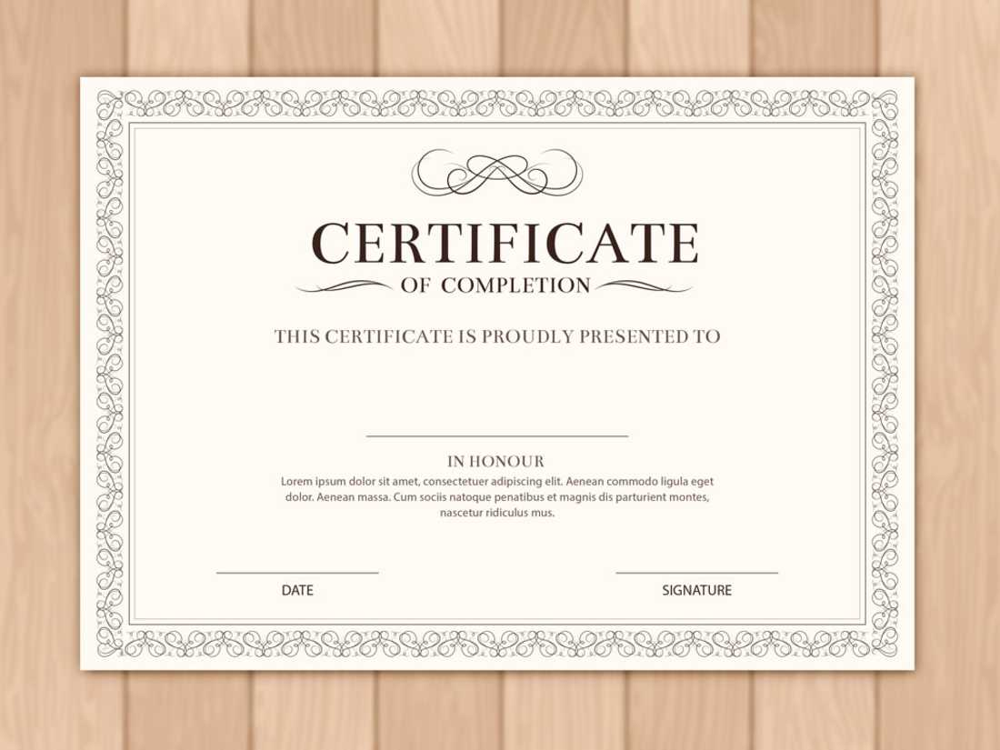
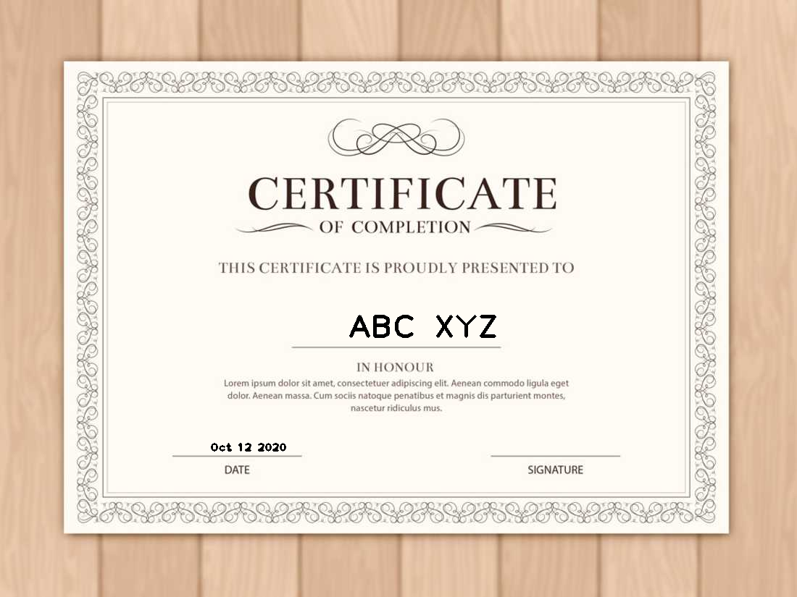

# Certificate-Generator

* This python program roughly detects the text on the certificate template and then places the fields like name, date on the certificate on its own.
* The input fields can be given in the form of an Excel sheet, and the information is extracted using openpyxl.
* Then it zips the output and saves all the generated certificates in a zipped file for easy maintainance.
* Any template can be fed and the fields would be placed roughly.

* Example
  
 

